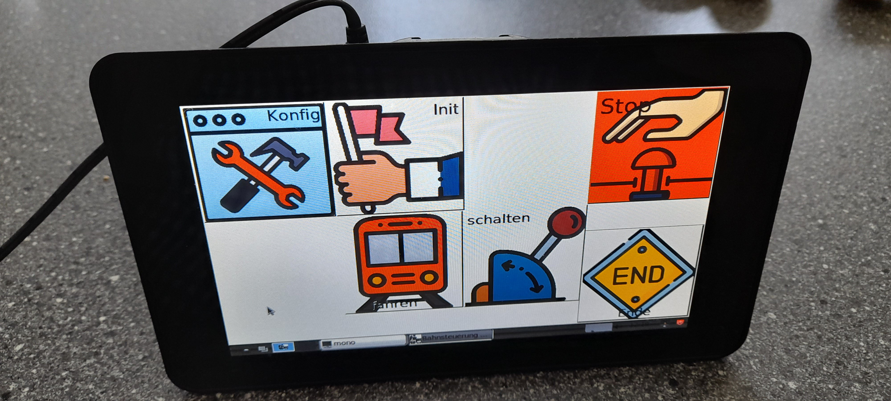
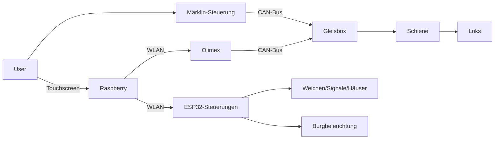

# Bahnsteuerung
Steuerung einer Märklin-Modelleisenbahn 
unter Verwendung der / oder in Anlehnung an Routinen aus dem [CANguru-System](https://github.com/CANguru-System)
## Änderungen zum Original
(wenn es denn so funktioniert)
* Steuerung durch angepasste Software auf einem Raspberry Pi mit Touchscreen
   
* Verbindung durch WLAN
## Struktur
> [!Note]
> geplant 

