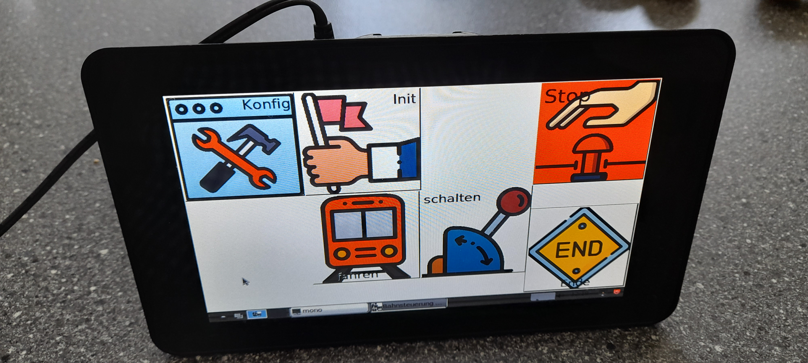
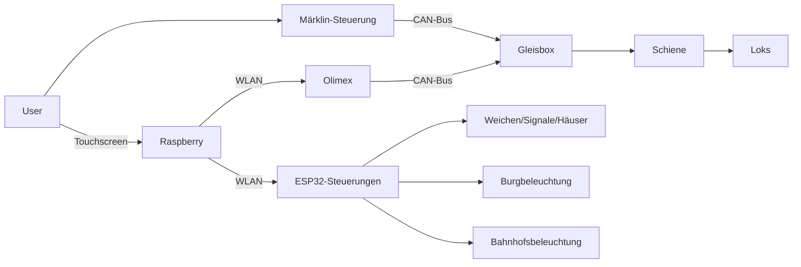

# Projektmappe Bahnsteuerung
Kern: 
-	Ein Raspberry-Touchscreen-Programm zur Steuerung der Anlage.

Darum herum: Verschiedene Ansätze und Testprogramme, auch zur Steuerung einzelner Bestandteile 
(Häuser, Beleuchtung, ...) der Anlage.

Unter anderem
- Bahnsteuerung
- Steuerprogramm
- PMqttServer
- PMqttBroker
- PTouch

Alles unter Verwendung der / oder in Anlehnung an Routinen aus dem [CANguru-System](https://github.com/CANguru-System)

## Änderungen zum Original

(wenn es denn so funktioniert)

* Steuerung durch angepasste Software auf einem Raspberry Pi mit Touchscreen 
* Verbindung durch WLAN

## Struktur

> [!Note] 
> geplant

```mermaid
flowchart LR
    User-->|Touchscreen| Raspberry 
    User-->Märklin-Steuerung
    Raspberry-->|WLAN| Olimex;
    Olimex-->|CAN-Bus| Gleisbox
    Märklin-Steuerung-->|CAN-Bus| Gleisbox
    Gleisbox-->Schiene
    Schiene-->Loks
    Raspberry-->|WLAN| ESP32-Steuerungen
    ESP32-Steuerungen-->Weichen/Signale/Häuser
    ESP32-Steuerungen-->Burgbeleuchtung
    ESP32-Steuerungen-->Bahnhofsbeleuchtung
  
```
## global
- Namespace Borys.Bahn.Bahnsteuerung
# Projektmappe Bahnsteuerung
enthält
- PTouch: Programm für den 800x480-Touchscreen
- Bahnsteuerung: Testprogramm, um CAN-Befehle zusammenzustellen und zu zu senden
- Steuerprogramm: Testprogramm, um Loks mit ihren Funktionen anzusprechen und CAN-Befehle zu senden
- MQTT-Tests
# LichtBurg
Beleuchtung der Burgruine und Szenario *Geisterstunde*
# LichtTonGrill
Beleuchtung und Musik für die Grillhütte
# LichtBahnhof
Beleuchtung Bahnhofsgebäude und Bahnsteig
# Anzeigetafel
... für den Bahnhof
# Uhr
... für den Bahnhof
# Förderturm
Motor und Lichteffekte
# Gasthaus
Beleuchtung für den Berggasthof und Aufzug im Aussichtsturm